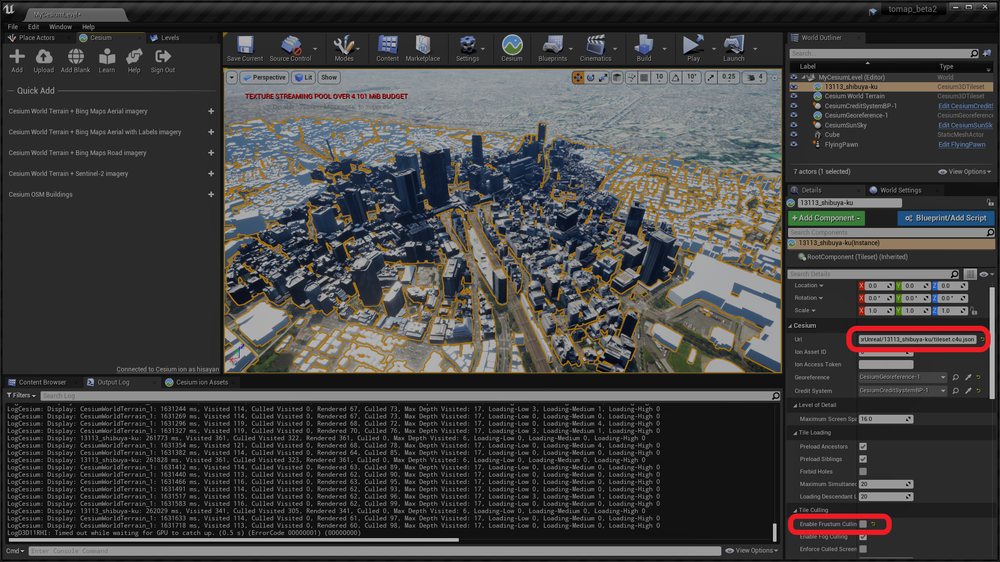

# rtcCenter2transform

PLATEAU の 3D Tiles を Cesium for Unreal で表示できるように微調整する変換ツールです。

A conversion tool that fine-tunes PLATEAU's 3D Tiles for display in Cesium for Unreal.

[Plateau Project](https://www.mlit.go.jp/plateau/)

[Cesium for Unreal](https://cesium.com/platform/cesium-for-unreal/)


## DEMO

[](https://www.youtube.com/watch?v=ynep8B1TuUE)

[](https://www.youtube.com/watch?v=UGqQjA7m864)

## usage

``` bash
$ npm install
$ node rtcCenter2transform ../13113_shibuya-ku/tileset.json > ../13113_shibuya-ku/tileset.c4u.json
```



Cesium3DTileset の

+ Url を変換後の tileset.c4u.json などに設定する
+ Enable Frustum Culling を false にする
  + こちら true だと建物の描写が視野角度などによって非表示になったりします。なにか視野角の計算座標がずれているような挙動ですので、true でも思った表示となるよう原因を調査したいのですが、まだ不明です。

## 変換内容について

glTF 1.0 で用いられていた、RTC_CENTER 拡張が、glTF 2.0 では、CESIUM界隈では機能しない仕様のようです。

ですが、現状の PLATEAU 提供の 3D Tiles は glTF 2.0 で、RTC_CENTER 拡張が利用されているようです。

Cesium のフォーラムでは、そのあたりの取り扱いについても議論がすすんでいるようですが、さしあたって動かしてみたいので、変換ツールをつくってみました。

矛盾を調整するために、RTC_CENTER 相当の座標変換を、tileset.json の transform に設定しています。

## 注意事項1

変換後の tileset.json は、transform パラメーターを追加したものの、RTC_CENTER パラメーター自体は取り除いていないため、Cesium ION などでは、表示できなくなる可能性があります。

## 注意事項2

当方の環境だと、新宿区はテクスチャが大きいのか、いったんは表示されるもののテクスチャの読み込みが進むと表示されなくなるような感じになり、UE4がハングアップします。

渋谷区もぎりぎり表示されているようなかんじです。

葛飾区などはテクスチャがほとんどないため、きもちよく表示されます。

```
AMD Ryzen 9 3950X 16-Core Processor
Memory 64GB 
GeForce RTX 2080 Ti GAMING X TRIO (11GB)
```

もし上手に新宿区を表示できた方がいらっしゃいましたら、ISSUE でもなんでもいいので、お教えいただけると大変たすかります。

## 作者から

PLATEAU プロジェクトも Cesium for Unreal も生まれたてで、どんどん進化するため、この変換ツールはすぐに用済みとなる可能性があり、そうなることを望んでいます。

## PLATEAU 3D Tiles

[東京23区 (the 23 wards of Tokyo)](https://www.geospatial.jp/ckan/dataset/plateau-tokyo23ku-3dtiles-2020)
